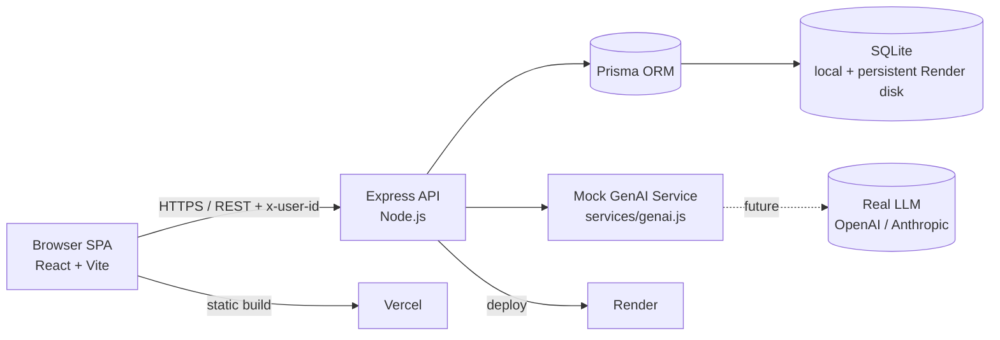

# WorkSmart — Architecture System Diagram

> Same Mermaid system diagram as in `docs/architecture.md`, rendered standalone.

## Layers

- **Browser SPA.** React 18 + Vite (JavaScript), Zustand store for shared identity and theme, local useState for page data. Communicates over HTTPS/REST, sending `x-user-id` for mock identity.
- **Express API.** Node.js service exposing REST routes; Prisma ORM; multer uploads (5MB cap); centralized error middleware; CORS enabled.
- **Prisma to persistent SQLite.** Local, Docker, and Render use the same tested schema; deployed storage lives on a mounted Render disk.
- **Mock GenAI Service.** `server/src/services/genai.js` keeps response contracts in one place. A real provider can retain the route and UI shapes after the server boundary is made asynchronous.
- **Deploy.** Client static build on Vercel; Docker API plus persistent SQLite disk on Render.
