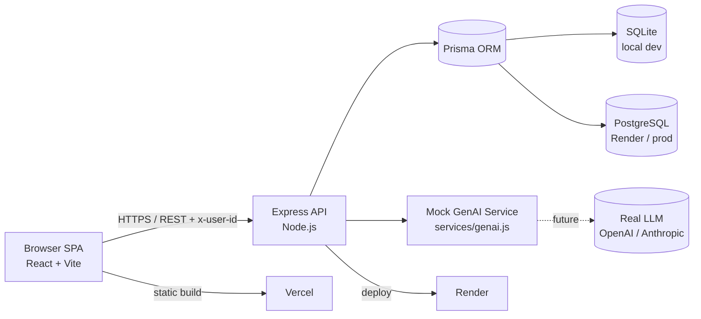

# WorkSmart — Architecture System Diagram

> Same Mermaid system diagram as in `docs/architecture.md`, rendered standalone.

## Layers

- **Browser SPA** — React 18 + Vite (JavaScript), React component-local state (no global store). Communicates over HTTPS/REST, sending `x-user-id` for mock identity.
- **Express API** — Node.js service exposing REST routes; Prisma ORM; multer uploads (5MB cap); centralized error middleware; CORS enabled.
- **Prisma → SQLite/Postgres** — SQLite for local dev, PostgreSQL (Render) for production; provider swapped via a single config line.
- **Mock GenAI Service** — `server/src/services/genai.js` pure-function boundary; swap path to a real LLM provider later without touching routes or UI.
- **Deploy** — client static build on Vercel; API + Postgres on Render.
