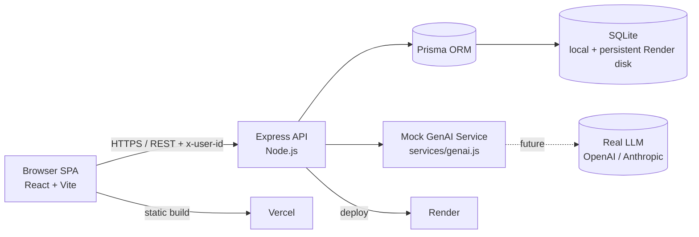

# WorkSmart — Architecture & Technical Decisions

## 1. System Diagram



## 2. Tech Decisions (ADR-style)

| Decision | Choice | Rationale |
|---|---|---|
| Frontend | React 18 + Vite (JavaScript) | Exam requires React; Vite for fast dev/build; JS per spec |
| State | Zustand single app store; per-page data in local useState | The mock user identity (`x-user-id`) and the theme are shared across pages, so they live in one Zustand store (`client/src/store/useAppStore.js`); page data stays request-scoped in local useState. |
| API | Node.js + Express | Same language as frontend; fast, minimal setup |
| Persistence | Prisma + SQLite on persistent volumes | Same tested schema locally, in Docker, and on Render; no unverified provider mismatch |
| File uploads | multer memory upload, 5MB cap, validated text formats | Retains analyzable content and rejects unsupported binaries clearly |
| GenAI | Rule-based mock engine | UX-first mocks: deterministic, no external API, swappable |
| Deploy | Vercel client + Render Docker API with persistent disk | Public deployment still requires account-owned manual publishing |

## 3. Data Model

```prisma
User    { id, name, email@unique, department, role, checkIns[] }
CheckIn { id, userId→User, hours, date, tag, activities, documentId?→Document, createdAt, updatedAt }
Document{ id, type, title, filename, mimeType, sizeBytes, contentText?, analysis?, status, checkIns[], createdAt, updatedAt }
```

**Rationale:**
- `CheckIn.documentId → Document` is what lets us compute *time spent per document* and *link effort to concrete outputs*. That is the central insight of the case study.
- `CheckIn.tag` powers activity analytics (smart/auto categorization + aggregation by dimension).
- `Document.type` is a validated string contract (`PO`/`QUOTE`/`REQ`/`OTHER`); `contentText` and `analysis` allow new document behavior without a database enum migration.
- `User.department` (string, not enum) and `role` support multi-user org units and admin/user distinction via seed data.

## 4. Multi-User Approach

The exam is explicitly UX-first and permits mock implementations. Real auth is out of scope, so identity is a **mock switcher**: the client persists a selected user and sends it as the `x-user-id` header; `authMiddleware` validates the header and **defaults to user `1` when absent**. Admin vs. user is determined by the seeded `role` field. This is documented as an assumption (no real authentication by design) and flagged for replacement with real RBAC in the roadmap.

## 5. GenAI Mock Design

All mock logic is isolated in `server/src/services/genai.js` as **pure functions** with stable contracts:

- `mockCategorize(text)` → `{ tag, confidence, source }`
- `mockAnalyzeDocument({ type, title, text })` → `{ fields, confidence, source }`
- `mockSuggestWorkflow({ type, status, analysis })` → `[{ action, reason, priority }]`
- `mockSearch(query, { checkins, documents })` → `{ intent, answer, results }`
- `mockTimeInsights(checkins)` → `[{ title, body, type }]`
- `mockAnomalies(checkins, documents)` → `[{ entity, type, detail, severity }]`

**Why isolate:** application services depend on stable response shapes rather than model-specific payloads. A real provider can keep the route and UI contracts, but the synchronous mock calls must become asynchronous and gain timeout, fallback, and provider configuration. See `docs/genai-approach.md` for the per-feature mapping.

**Interface contracts → real LLM path (`docs/genai-approach.md`):**
- **Categorize / Analyze** → function calling / structured-output schemas (JSON mode) with prompt + few-shot examples.
- **Search** → embeddings + RAG over check-ins/documents; the model converts the question to a semantic query and generates a cited answer.
- **Insights / Anomalies** → prompt-based summarization over aggregated stats and statistical baselines.

## 6. Extensibility

- **New document types.** `Document.type` is a validated string; adding a type requires updating the shared service/UI contract and its analysis rules, without a schema migration.
- **New departments / org units.** `User.department` is a string, not an enum; admin-managed orgs are a roadmap item.
- **New GenAI features.** add a pure function in `genai.js` + a route; UI consumes the same JSON shape.
- **New analytics dimensions.** `aggregateBy(checkins, dimension)` already generalizes over any field.
- **Single GenAI swap path.** implement a `GenAIProvider` interface (`MockProvider` today, `LLMProvider` later) behind the existing service boundary.

## 7. Security & Robustness

- Input validation on every route (parser rejects empty/non-numeric/negative hours; document status validated against an allow-list); invalid input returns `400` JSON.
- 5MB upload cap via multer; TXT, Markdown, CSV, JSON, and LOG are accepted. Other formats return a 400 response instead of losing the file body.
- Central `errorHandler` middleware returns consistent JSON `{ error }`; unknown routes return `404` JSON, server errors `500` JSON.
- CORS is enabled for cross-origin deployment (client on Vercel, API on Render); origin-locking is slated for the roadmap.
- Note: the in-memory aggregations in `/api/analytics/time`, `/api/ai/insights`, `/api/ai/anomalies`, and `/api/ai/search` load all rows into the API process. This is correct and fast at the seeded scale (2 to 5k rows); at enterprise scale these become SQL `groupBy` queries. Documented as a scaling step.
