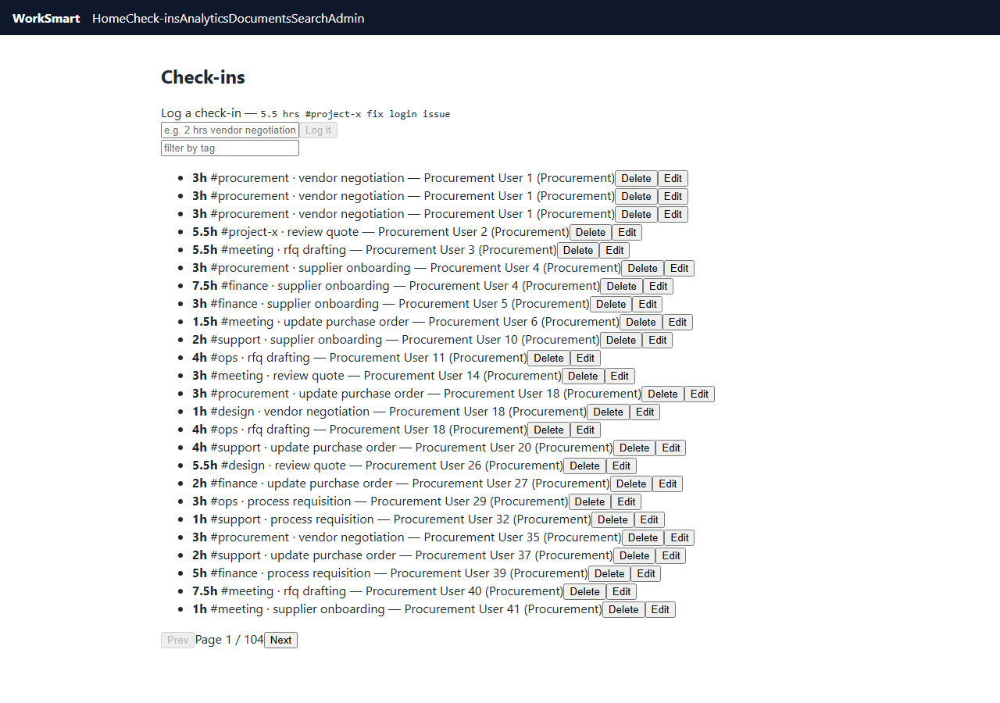
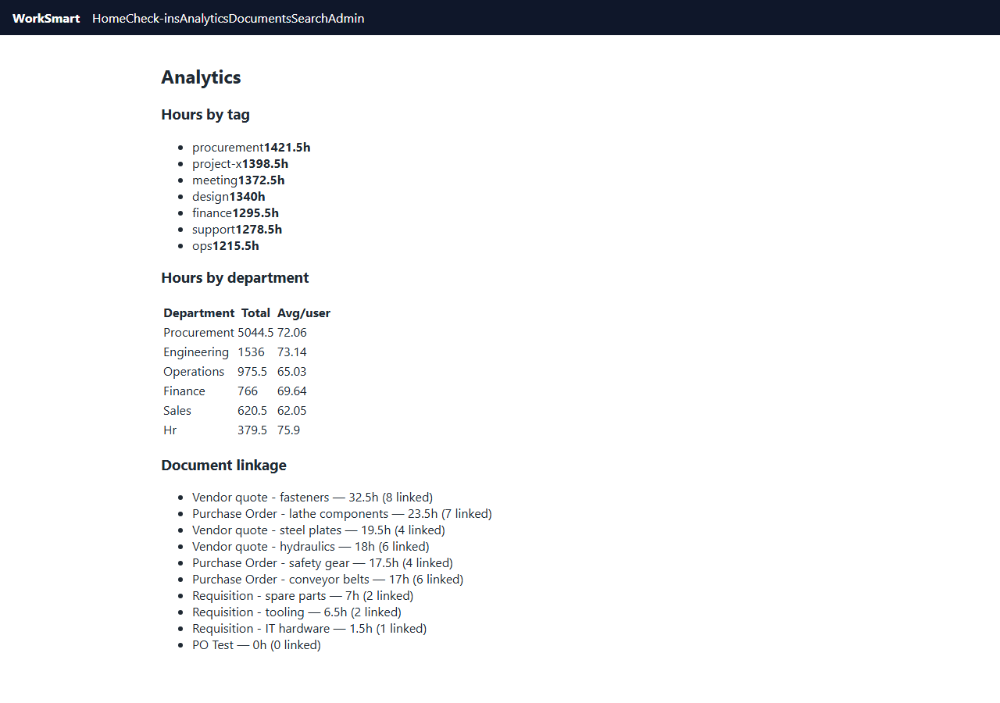
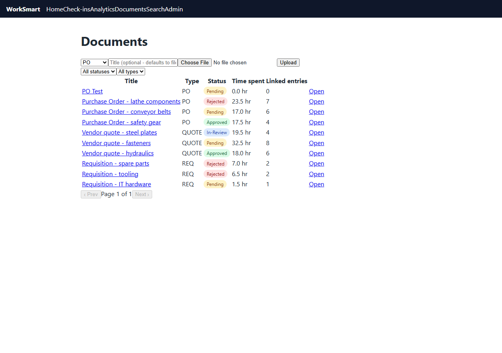
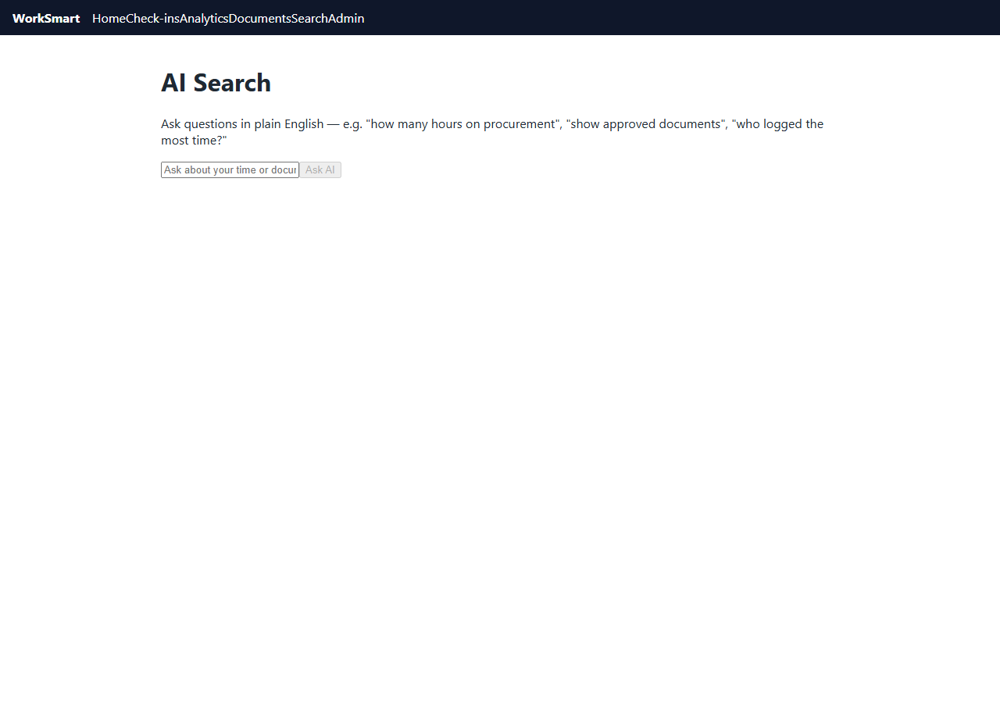
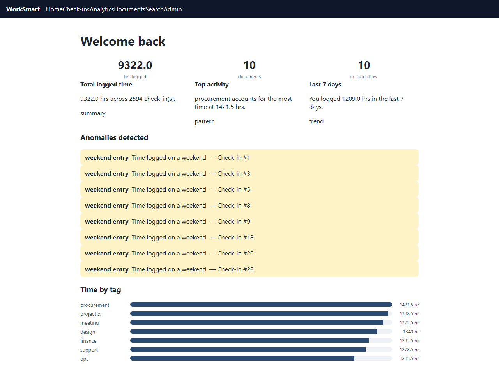
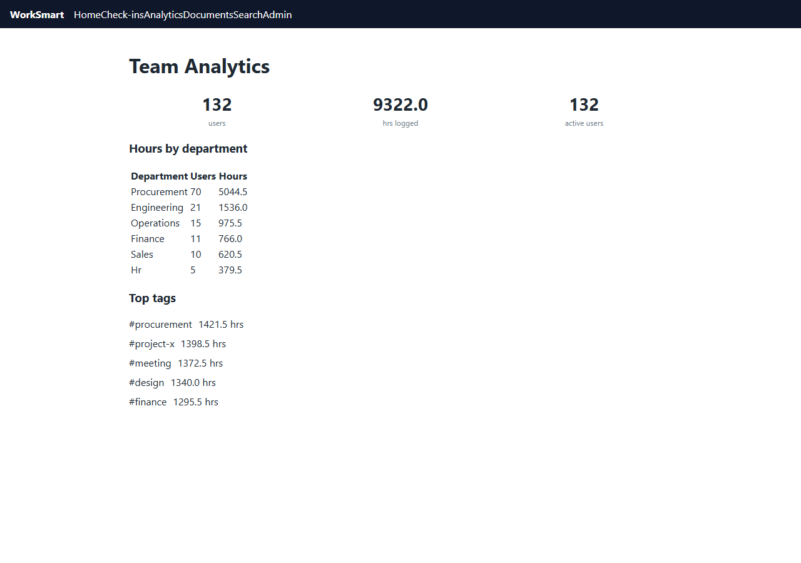

# Meridian — User Guide

A practical, click-by-click guide to the everyday workflows in WorkSmart (Meridian).
The app starts with a mock identity picker. Choose a seeded user, then use the
left sidebar to move between workflows.

> **Screenshots:** Each workflow below includes a real screenshot captured from
> the running app (`docs/screenshots/*.png`, produced by
> `scripts/capture-screenshots.mjs` driving Playwright against the local Docker
> stack).

---

## 1. Logging a check-in

**Where:** sidebar → **Check-ins**.

1. Open **Check-ins**. You'll see a "Log a check-in" card near the top.
2. Type your entry in the free-text format, e.g.
   `5.5 hrs #project-x fix login issue`.
3. As you type, the **parse preview** appears under the input and shows the
   parsed result (`5.5 hr · #project-x`) confirms the hours and tag were
   understood.
4. If the parser falls back to the `general` tag, a **Smart tag** checkbox is
   offered ("Smart tag this entry (AI)"). Tick it to let the AI suggest a more
   specific tag.
5. Press **Log it**. The entry is added to the list below and the form clears.

---

## 2. Viewing, filtering, editing, and deleting check-ins

**Where:** sidebar → **Check-ins**.

1. Every entry is listed as a line: `<hours>h #tag · activities, user (department)`,
   with **Delete** and **Edit** buttons beside it.
2. **Filter:** type a tag into the "filter by tag" input at the top of the list
   to narrow results to that tag.
3. **Paginate:** use **Prev** / **Next** at the bottom (25 per page). The
   pager shows `Page N / M`.
4. **Edit:** click **Edit** on an entry. Editable fields (hours, tag,
   activities) appear inline. Change values and press **Save** (or **Cancel**).
5. **Delete:** click **Delete** to remove the entry; the list reloads.

---

## 3. Viewing analytics by tag, date, department, and user

**Where:** sidebar → **Analytics**.

1. The page loads three sections:
   - **Hours by tag:** a list of tags with their total hours.
   - **Hours by department:** a table of `Department / Total / Avg per user`.
   - **Document linkage:** for each document, `title: <linkedHours>h (<n> linked)`.
2. Read the **Hours by tag** list to see which projects consumed the most time.
3. Open the **Hours by department** table to compare teams.
4. Use the **Document linkage** section to see how much time each procurement
   document has absorbed. (Per-user and date breakdowns are surfaced via the
    AI Search and Admin views (see workflows 6 and 7).)

---

## 4. Uploading a procurement document and moving it through the status flow

**Where:** sidebar → **Documents**.

1. On the **Documents** page, use the **Upload** form: choose a type
   (`PO`, `QUOTE`, `REQ`, `OTHER`), optionally give it a title, and pick the
   file. Press **Upload**. It appears in the table with status `pending`.
2. Use the **status** and **type** filter dropdowns to narrow the table.
3. Click a document row (or navigate to `/documents/:id`) to open its detail page.
4. On the detail page, click **Analyze with AI** (in the *AI Document Analysis*
   card). Extracted fields render as a key/value list with a confidence score
   (mock rule-based extraction).
 5. Scroll to **Suggested next steps:** the system proposes workflow actions
   with priority badges. These refresh via **Get suggestions**.
6. Move the document through the workflow using the segmented status buttons:
   `pending → in-review → approved` (or `rejected`). The active status is
   highlighted and a status badge reflects the current state.

---

## 5. Linking time to a document

**Where:** a document's detail page (`/documents/:id`).

1. On the document detail page, find the **"Log time against this document"**
   card.
2. Type a check-in that references the work, e.g.
   `2 hrs #procurement review vendor quote`, and press **Log**.
3. The entry is saved with `documentId` set. The **"Total time spent"** line on
   the document updates (e.g. `Total time spent: 2.0 hr across 1 linked
   check-in(s).`).
4. The new entry also appears in the **Linked time entries** table
   (Date / Hours / Tag / Activities / User), which feeds the analytics
   "Document linkage" view from workflow 3.

---

## 6. Asking the AI search

**Where:** sidebar → **AI Search**.

1. On the **AI Search** page, type a plain-English question, e.g.
   `"how much time on procurement this month?"`.
2. Press **Ask AI**. While it processes, the button shows `Thinking…`.
3. The **AI:** answer card returns a natural-language response.
 4. If the query matched records, a **Matches** card lists result cards, each
   showing a `#tag`, the activities/title, and `hrs · user/status`.

---

## 7. Dashboard insights, anomaly banners, and team analytics

 

**Where:** sidebar → **Dashboard** and **Admin**.

### Dashboard (Home)
1. The home page opens with a **stat cards grid**: `hrs logged`, `documents`,
   and `in status flow` counts.
2. A second grid shows **time insights** cards (from the AI insights feed).
3. If anomalies were detected, an **"Anomalies detected"** card lists
   **AnomalyBanner** items explaining unusual patterns.
4. A **"Time by tag"** chart summarizes logged hours per tag.

### Admin: team analytics
1. Open **Admin** → **Team Analytics**. Stat cards show `users`, `hrs logged`,
   and `active users`.
2. The **Hours by department** table breaks hours down per department
   (Department / Users / Hours).
3. The **Top tags** list ranks the highest-hour tags across the whole team.
